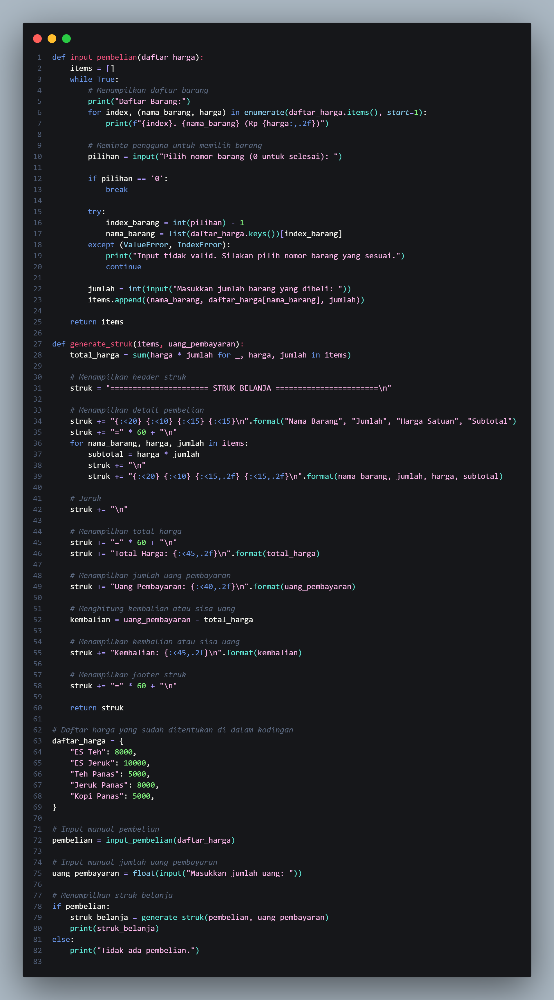

# project-UAS
## Membuat Kodingan Struk Kasir

## Code


## Output


## Penjelasan

### 1. Fungsi input_pembelian(daftar_harga)

```python
def input_pembelian(daftar_harga):
    items = []
    while True:
        # Menampilkan daftar barang
        print("Daftar Barang:")
        for index, (nama_barang, harga) in enumerate(daftar_harga.items(), start=1):
            print(f"{index}. {nama_barang} (Rp {harga:,.2f})")

        # Meminta pengguna untuk memilih barang
        pilihan = input("Pilih nomor barang (0 untuk selesai): ")
        
        if pilihan == '0':
            break

        try:
            index_barang = int(pilihan) - 1
            nama_barang = list(daftar_harga.keys())[index_barang]
        except (ValueError, IndexError):
            print("Input tidak valid. Silakan pilih nomor barang yang sesuai.")
            continue

        jumlah = int(input("Masukkan jumlah barang yang dibeli: "))
        items.append((nama_barang, daftar_harga[nama_barang], jumlah))
    
    return items
```
1. while True:: Perulangan tak terbatas dimulai. Ini berarti program akan terus berjalan selama kondisi True.
2. Menampilkan Daftar Barang: Program menampilkan daftar barang beserta harganya kepada pengguna menggunakan perulangan for.
3. Meminta Pengguna Memilih Barang: Pengguna diminta memilih nomor barang yang ingin dibeli atau memasukkan '0' untuk selesai.
4. Penghentian Program: Jika pengguna memasukkan '0', program keluar dari perulangan dengan break.
5. Penanganan Kesalahan: Menggunakan blok try-except untuk menangani kesalahan jika pengguna memasukkan input yang tidak valid.
6. Menambahkan Pembelian ke List items: Jika input valid, informasi barang dan jumlahnya ditambahkan ke dalam list items.
7. Mengembalikan List items: Setelah pengguna selesai memilih barang, list items yang berisi rincian pembelian dikembalikan.

### 2. Fungsi generate_struk(items, uang_pembayaran)

```python
def generate_struk(items, uang_pembayaran):
    total_harga = sum(harga * jumlah for _, harga, jumlah in items)
    
    # Menampilkan header struk
    struk = "====================== STRUK BELANJA =======================\n"

    # Menampilkan detail pembelian
    struk += "{:<20} {:<10} {:<15} {:<15}\n".format("Nama Barang", "Jumlah", "Harga Satuan", "Subtotal")
    struk += "=" * 60 + "\n"
    for nama_barang, harga, jumlah in items:
        subtotal = harga * jumlah
        struk += "{:<20} {:<10} {:<15,.2f} {:<15,.2f}\n".format(nama_barang, jumlah, harga, subtotal)

    # Jarak
    struk += "\n"

    # Menampilkan total harga
    struk += "=" * 60 + "\n"
    struk += "Total Harga: {:<45,.2f}\n".format(total_harga)

    # Menampilkan jumlah uang pembayaran
    struk += "Uang Pembayaran: {:<40,.2f}\n".format(uang_pembayaran)

    # Menghitung kembalian atau sisa uang
    kembalian = uang_pembayaran - total_harga

    # Menampilkan kembalian atau sisa uang
    struk += "Kembalian: {:<45,.2f}\n".format(kembalian)

    # Menampilkan footer struk
    struk += "=" * 60 + "\n"
    
    return struk
```
1. Menghitung Total Harga: Menggunakan sum dan list comprehension untuk menghitung total harga berdasarkan informasi pembelian.
2. Header Struk: Menambahkan header struk ke variabel struk.
3. Detail Pembelian: Menambahkan rincian pembelian ke variabel struk menggunakan perulangan for.
4. Total Harga: Menampilkan total harga pembelian.
5. Uang Pembayaran: Menampilkan jumlah uang yang diberikan oleh pelanggan.
6. Menghitung Kembalian: Menghitung kembalian atau sisa uang dengan mengurangkan total harga dari uang pembayaran.
7. Menampilkan Kembalian: Menampilkan kembalian atau sisa uang.
8. Footer Struk: Menambahkan footer struk ke variabel struk.
9. Mengembalikan Struk: Mengembalikan struk sebagai string.

### 3. Input Manual, Menampilkan Struk, dan Main Program

```python
# Daftar harga yang sudah ditentukan di dalam kodingan
daftar_harga = {
    "ES Teh": 8000,
    "ES Jeruk": 10000,
    "Teh Panas": 5000,
    "Jeruk Panas": 8000,
    "Kopi Panas": 5000,
}

# Input manual pembelian
pembelian = input_pembelian(daftar_harga)

# Input manual jumlah uang pembayaran
uang_pembayaran = float(input("Masukkan jumlah uang: "))

# Menampilkan struk belanja
if pembelian:
    struk_belanja = generate_struk(pembelian, uang_pembayaran)
    print(struk_belanja)
else:
    print("Tidak ada pembelian.")
```
1. Daftar Harga: Mendefinisikan daftar harga barang.
2. Input Manual Pembelian: Menggunakan fungsi input_pembelian untuk meminta input pembelian dari pengguna.
3. Input Manual Jumlah Uang Pembayaran: Meminta pengguna memasukkan jumlah uang yang diberikan.
4. Menampilkan Struk Belanja: Jika ada pembelian, program akan menampilkan struk belanja menggunakan fungsi generate_struk.
5. Tidak Ada Pembelian: Jika tidak ada pembelian, program akan memberi tahu pengguna bahwa tidak ada pembelian.

## Video 
